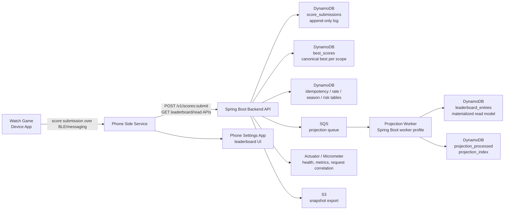

# Parallax Pilot

## What this project demonstrates

Parallax Pilot is a portfolio project focused on Senior Java Backend and system design judgment rather than feature sprawl.

This repository demonstrates:

- Java 21 and Spring Boot backend engineering
- system design trade-offs explained honestly
- event-driven read-model projection through SQS
- DynamoDB-style source-of-truth and projection separation
- idempotent API design for retry-heavy clients
- correctness under retries, concurrency, and stale async work
- pragmatic operational awareness with metrics, request correlation, and rebuild paths
- realistic growth-stage thinking instead of pretending hyperscale problems are already solved

## Product summary

Parallax Pilot is a single-player watch game. A player flies a ship, survives as long as possible, and submits a score after a run.

The backend supports:

- global leaderboard
- daily leaderboard
- seasonal leaderboard
- anonymous player identity without a full login flow in v1
- player-best classification and submitted-round classification

The backend can tell the player how their best score ranks and where a newly submitted round would roughly land. For deeper ranks, approximate classification is an intentional trade-off.

## Backend system at a glance

- Java 21
- Spring Boot
- Maven
- DynamoDB
- SQS
- S3
- AWS SDK v2
- Micrometer + Actuator
- LocalStack + Testcontainers integration tests
- Terraform baseline for AWS resources

The cloud baseline exists, but the main showcase is backend design quality: correctness, projection architecture, retry behavior, and honest ranking trade-offs.

## Architecture diagram



## Core backend design decisions

- `best_scores` is the canonical source of truth for leaderboard ownership per player and scope.
- `leaderboard_entries` is a materialized projection optimized for fast leaderboard reads.
- `score_submissions` is append-only so the system can debug, audit, and rebuild projections.
- Projection is asynchronous through SQS so the write path stays focused on canonical state.
- Ranking and classification are bounded projection-based in the current version, not hyperscale exact global rank.
- Anti-abuse is pragmatic trust-hardening, not a claim of full anti-cheat.

## Write path: score submission

1. The watch/phone path submits a `SubmitScoreRequest`.
2. The API validates request shape, bounds, timestamps, and identifier format.
3. An idempotency guard checks `submissionId`.
4. Anti-abuse assessment runs and can mark the request suspicious or quarantined.
5. The submission is stored in the append-only submission log.
6. Quarantined submissions stop before canonical best-score update.
7. A conditional write updates `best_scores` only when the new score is actually better.
8. Projection tasks are published only when the canonical best score improved.
9. The response returns both the current player-best classification and submitted-round classifications.

## Read path: leaderboard and classification

- leaderboard reads (`/v1/leaderboards/{scope}`) read from `leaderboard_entries`
- around-me reads also use the projected leaderboard read model
- player-best reads (`/v1/players/{playerId}/best`) read from canonical `best_scores`
- classification uses bounded projection scanning and can return either exact rank or approximate band

The current design is intentionally described as a growth-stage read path. Exact answers are reliable near the top and within configured bounds. At larger scale, this evolves toward top-N materialization plus approximate bucket or histogram rank estimation.

## Correctness model

- score submission is idempotent by `submissionId`
- duplicate retries return accepted duplicate responses instead of reapplying writes
- concurrent submits from the same player resolve through conditional best-score updates
- stale projection tasks are rejected by comparing against current canonical best score
- projection task processing is deduped through `projection_processed`
- projections can be rebuilt from the append-only submission log

## Ranking model

Ranking order is deterministic:

1. score descending
2. survivedMs descending
3. playedAt ascending
4. playerId ascending as deterministic fallback

Two classification views matter:

- current player-best classification
- submitted-round classification

Those are not the same thing. A submitted round may not become the player’s best score. Submitted-round classification also excludes the same player’s existing projected entry to avoid double-counting and is marked as `estimated_from_bounded_projection`.

## Idempotency and retries

This system is designed for retry-heavy client behavior. The watch and phone path can retry because of BLE hops, phone connectivity, or API/network instability.

`IdempotencyRepository` ensures retries do not double-apply canonical state updates. A duplicate submission is treated as a known outcome, not an exceptional failure. That makes the write API safe under at-least-once delivery behavior from the client path.

## Async projection model

Projection tasks are published after canonical best-score improvement. The worker drains SQS, rejects stale tasks, replaces the old projected entry for the same player and scope, and updates the materialized leaderboard.

This gives a clean separation:

- canonical correctness in `best_scores`
- fast read model in `leaderboard_entries`
- replay and rebuild path from `score_submissions`

It also means API success and projection visibility are intentionally decoupled.

## Anti-abuse and trust model

This backend does not pretend to prove fair play cryptographically.

The client reports the score, so the system is fundamentally client-authoritative in v1. The backend hardens trust with:

- request validation
- score and survival sanity checks
- rate limiting
- suspicious and quarantined submissions
- risk reason capture
- admin debug tooling

That is abuse resistance and trust-hardening, not full anti-cheat.

## Observability

Implemented observability includes:

- `X-Request-Id` request correlation header
- MDC request ID for log correlation
- Actuator `health`, `info`, and `metrics`
- submission, projection, and snapshot logs
- latency timers such as `leaderboard.submit.latency` and `leaderboard.read.latency`
- admin auth failure counter `leaderboard.admin.auth.failures`
- SQS queue metrics:
  - `leaderboard.projection.queue.visible`
  - `leaderboard.projection.queue.inflight`
  - `leaderboard.projection.queue.delayed`
  - `leaderboard.projection.queue.oldest_age_seconds`
  - `leaderboard.projection.queue.metrics.refresh.failures`

## Testing strategy

The project includes:

- unit tests
- controller tests
- LocalStack/Testcontainers integration tests
- projection dedupe tests
- projection concurrency tests
- queue metrics tests
- Zepp-side JavaScript harness tests

The goal is to validate both business rules and the failure cases that matter in event-driven backend design.

## Local validation

Validated commands for this repository:

```bat
cmd /c npm test
cmd /c npm run build
cmd /c npm run build:backend
cmd /c npm run backend:test
cmd /c npm run backend:verify
```

For the interview-style deep dive, see [docs/SYSTEM_DESIGN_REVIEW.md](docs/SYSTEM_DESIGN_REVIEW.md).

## Current limitations

- ranking/classification is bounded and not hyperscale exact global ranking
- there is no full user login flow in v1
- anti-abuse is limited by the client-authoritative score model
- S3 snapshot export exists, but restore/diff tooling is not implemented
- production CloudWatch dashboards and alarm tuning are not implemented here
- multi-region deployment is not implemented or verified

## Evolution path

### MVP / portfolio version

- append-only submission log
- canonical best-score table
- async projection for leaderboard reads
- bounded rank classification
- pragmatic anti-abuse and admin debug path

### Production single-region version

- tuned dashboard and alarms
- readiness indicators for dependencies
- stronger admin tooling
- explicit operational SLOs and alert thresholds
- cleaner deployment automation around the existing baseline

### Larger-scale version

- materialized top-N lists per scope
- approximate rank buckets or histograms for deeper ranks
- stronger trust signals or attestation if the platform supports it
- stream-based analytics and richer abuse heuristics
- stronger operator tooling for replay, restore, and investigation
- multi-region read scaling where justified