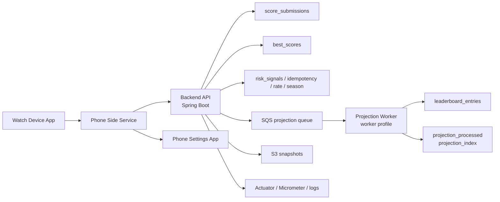
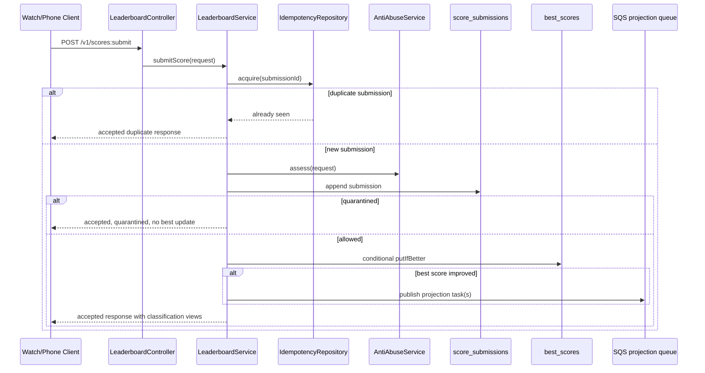
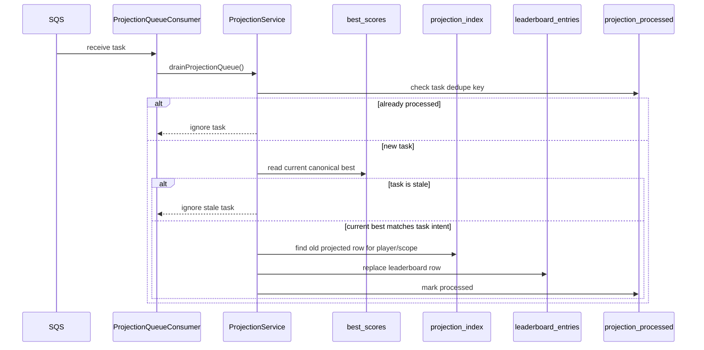
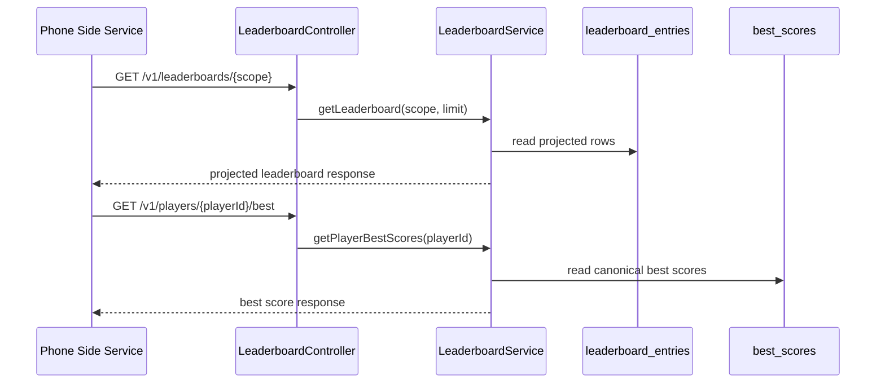
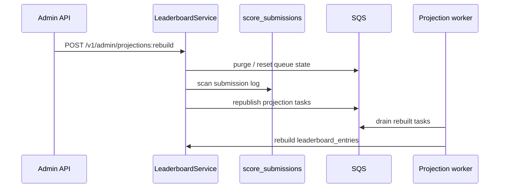

# System Design Review: Parallax Pilot Leaderboard Backend

## 1. Problem statement

Parallax Pilot is a single-player watch game. After a run, the client submits a score representing survival and game performance. The backend must store the result, determine whether it improves the player’s best score, update leaderboard views, and tell the player how their score or submitted round classifies.

The system is intentionally designed as a Senior Java Backend portfolio piece, so the interesting problem is not raw CRUD. The interesting problem is correctness under retries, async projection, bounded ranking, and honest trade-off management.

## 2. Requirements

Functional requirements:

- accept score submissions
- support global, daily, and seasonal leaderboard scopes
- return player-best classification
- return submitted-round classification
- support duplicate client retries safely
- expose admin operations for projection drain, rebuild, season cutover, snapshot export, and submission debug

## 3. Non-functional requirements

- idempotent write behavior
- deterministic ranking rules
- safe behavior under concurrent submits from the same player
- rebuildable leaderboard state
- bounded, operationally simple read path for a portfolio/growth-stage system
- observability sufficient for queue lag and request correlation
- local AWS-like integration validation through LocalStack/Testcontainers

## 4. Main assumptions

- gameplay is single-player
- the score comes from an untrusted client path
- there is no normal login flow in v1
- anonymous identity is acceptable for the product stage
- exact global rank at very large scale is not a synchronous requirement
- projection lag is acceptable as long as canonical correctness is preserved

## 5. High-level architecture

The runtime split is deliberate:

- API runtime owns canonical state transition
- worker runtime owns async leaderboard projection
- phone side bridges the watch and backend

## 6. Data ownership and source of truth

The most important architectural choice in this system is that leaderboard projection is not the source of truth.

- `score_submissions` is the append-only audit and rebuild log
- `best_scores` is the canonical source of truth for each player’s best score in each scope
- `leaderboard_entries` is a materialized read model optimized for fast reads

This makes stale async work easier to reason about. If a projection task arrives late, the worker can compare against canonical best-score state and reject stale work instead of trying to infer correctness from the read model.

## 7. Data model

| Logical store | Purpose | Type | Key access pattern | Failure / rebuild role |
| --- | --- | --- | --- | --- |
| `score_submissions` | append-only record of submitted rounds | source-of-truth log | write by `submissionId`, admin/debug scans, rebuild scans | rebuild projection, audit, postmortem |
| `idempotency` | prevents duplicate submit re-application | supporting | lookup/update by `submissionId` | safe retries from watch/phone/network |
| `best_scores` | canonical best score per player and scope | source of truth | lookup/update by player + scope | authoritative state for ranking ownership |
| `leaderboard_entries` | materialized leaderboard read model | projection | top-N / bounded leaderboard reads by scope | can be rebuilt from canonical sources |
| `projection_processed` | dedupe of processed projection tasks | supporting | lookup by projection task key | safe at-least-once worker consumption |
| `projection_index` | helps replace old projected row for same player/scope | supporting | lookup by player + scope | stale projection cleanup |
| `risk_signals` | stores risk reasons for suspicious/quarantined traffic | supporting | lookup by submission/player | abuse investigation and debug |
| `season_metadata` | stores active season information | supporting | lookup active season | seasonal scope resolution and manual cutover |
| `rate_limit` / abuse counters | submit throttling state | supporting | per-player / time-bucket lookups | pragmatic abuse resistance |
| `snapshot bucket` | S3 export of operational snapshot | supporting | write snapshot object, future list/download | export exists, restore is future work |

## 8. Score submission flow

Important implementation detail: the response contains both the player-best classification and submitted-round classifications. That lets the client distinguish “your current best standing” from “where this specific round would land.”

## 9. Projection flow

The worker is intentionally separate from the API profile. That keeps the API runtime simple and makes projection lag explicit instead of hidden.

## 10. Leaderboard read flow

Read decisions:

- leaderboard and around-me use the materialized read model
- best-score reads come from canonical state
- classification is bounded and projection-based in the current version

## 11. Submitted-round classification

Submitted-round classification answers a different question than player-best classification.

- player-best classification: where the player’s current canonical best stands
- submitted-round classification: where this submitted round would land if evaluated against the bounded projection

The implementation excludes the same player’s existing projected entry when evaluating the submitted round. That avoids double-counting an existing player as if they were two different leaderboard participants.

The response marks this basis honestly as `estimated_from_bounded_projection`.

## 12. Correctness and consistency

Correctness rules:

- canonical best score changes only through conditional write
- duplicate retries do not double-apply state
- stale async tasks do not overwrite newer canonical truth
- read projection may lag, but canonical truth stays correct
- leaderboard can be rebuilt from submission log

Consistency model:

- write path preserves canonical correctness first
- read path is eventually consistent through projection
- submitted response can acknowledge accepted canonical state before projection catches up

## 13. Idempotency and retry behavior

The system assumes retries are normal, not exceptional.

Retry sources include:

- watch to phone delivery retries
- phone to API retries
- client uncertainty after timeouts

`IdempotencyRepository` turns `submissionId` into a stable API contract. A duplicate request is returned as an accepted duplicate outcome. This is the correct behavior for unreliable networks and device hops.

## 14. Concurrency handling

Concurrency matters when the same player submits multiple close-together rounds.

The design handles this with:

- conditional best-score update rules
- deterministic ranking helper `LeaderboardRanking`
- stale projection rejection against canonical best score
- processed-task dedupe for the worker

That means concurrent requests can race, but the final canonical state is still coherent.

## 15. Failure modes and recovery

| Failure | Expected behavior | Implementation mechanism | Remaining limitation |
| --- | --- | --- | --- |
| duplicate client retry | accepted duplicate, no double update | `IdempotencyRepository` | assumes stable `submissionId` generation |
| API succeeds but projection is delayed | canonical state is correct, read model may lag | async SQS projection | client may temporarily see older leaderboard |
| stale projection task arrives after newer best score | stale task ignored | compare task against current best score | extra worker churn still exists |
| projection worker crashes mid-processing | task can be re-consumed and deduped | SQS + `projection_processed` | still eventual, not immediate |
| suspicious or quarantined score | stored with risk context, blocked from canonical update when quarantined | anti-abuse assessment + `risk_signals` | not proof of cheating |
| admin rebuild during active traffic | rebuild lock and replay path reduce chaos | rebuild lock + replay from log | still operationally sensitive |
| SQS metrics refresh failure | app stays up, failure counted, last good metrics preserved | cached snapshot + failure counter | queue metrics can become stale until refresh recovers |
| malformed request | request rejected cleanly | DTO and controller validation | validation cannot prove honest gameplay |
| LocalStack/Testcontainers unavailable | integration validation cannot run | docs/runbook separate Docker-dependent checks | local full verify depends on Docker |

## 16. Anti-abuse and trust boundaries

The score comes from the client, so the backend cannot fully prove the run was fair.

Trust boundaries:

- the watch and phone path are not authoritative proof of fair play
- the backend validates shape and sanity, not physical gameplay truth

Current mitigation approach:

- validation of request structure and ranges
- future-time rejection for `playedAt`
- rate limiting
- suspicious/quarantined classifications
- risk reason persistence
- admin debug endpoint for investigation

This is intentionally described as trust-hardening, not anti-cheat solved.

## 17. Observability and operations

Implemented:

- Actuator `health`, `info`, `metrics`
- `X-Request-Id` response propagation
- MDC request correlation key `requestId`
- submission and projection logs
- latency timers:
  - `leaderboard.submit.latency`
  - `leaderboard.read.latency`
  - `leaderboard.projection.drain.latency`
  - `leaderboard.snapshot.export.latency`
- counters such as:
  - `leaderboard.submissions`
  - `leaderboard.projection.messages.processed`
  - `leaderboard.snapshots.exported`
  - `leaderboard.admin.auth.failures`
- queue metrics:
  - `leaderboard.projection.queue.visible`
  - `leaderboard.projection.queue.inflight`
  - `leaderboard.projection.queue.delayed`
  - `leaderboard.projection.queue.oldest_age_seconds`
  - `leaderboard.projection.queue.metrics.refresh.failures`

Still intentionally missing:

- tuned CloudWatch dashboards and alarms
- production alert thresholds
- readiness indicators for dependencies
- distributed tracing / OpenTelemetry

## 18. Testing strategy

The repository validates the backend through multiple layers:

- unit tests for isolated rules and services
- controller tests for API boundary behavior
- LocalStack/Testcontainers integration tests for DynamoDB, SQS, and S3 behavior
- projection dedupe tests
- projection concurrency tests
- queue metrics tests
- Zepp-side JavaScript harness tests for client-side integration logic

That mix is important for a portfolio backend because it demonstrates both code-level discipline and architecture-level verification.

## 19. Current limitations

- bounded ranking/classification is not the same as hyperscale exact rank
- full login and identity recovery are out of scope in v1
- anti-abuse cannot fully verify legitimate gameplay because the client reports the score
- S3 snapshot export exists, but restore and diff tooling do not
- production dashboards, alerting, and deeper operator tooling are future work
- multi-region deployment is not implemented

## 20. Scaling evolution

Near-term production evolution:

- add dashboards and alert thresholds on queue lag, failures, and API health
- add readiness checks for SQS, DynamoDB, and S3
- add stronger admin replay and investigation tooling

Larger-scale evolution:

- materialized top-N lists per scope
- approximate bucket or histogram-based rank estimation for deep ranks
- stronger trust or attestation if the platform supports it
- stream-based analytics and richer abuse heuristics
- multi-region read scaling if the product warrants it

## 21. Interview discussion points

- Why `best_scores` is canonical and `leaderboard_entries` is not
- Why async projection is the right trade-off here
- How duplicate retries are treated as first-class behavior
- Why bounded ranking is an honest and practical growth-stage choice
- How stale projection tasks are rejected safely
- Why anti-abuse is described as trust-hardening instead of anti-cheat solved
- How this design could evolve without rewriting the ingestion model